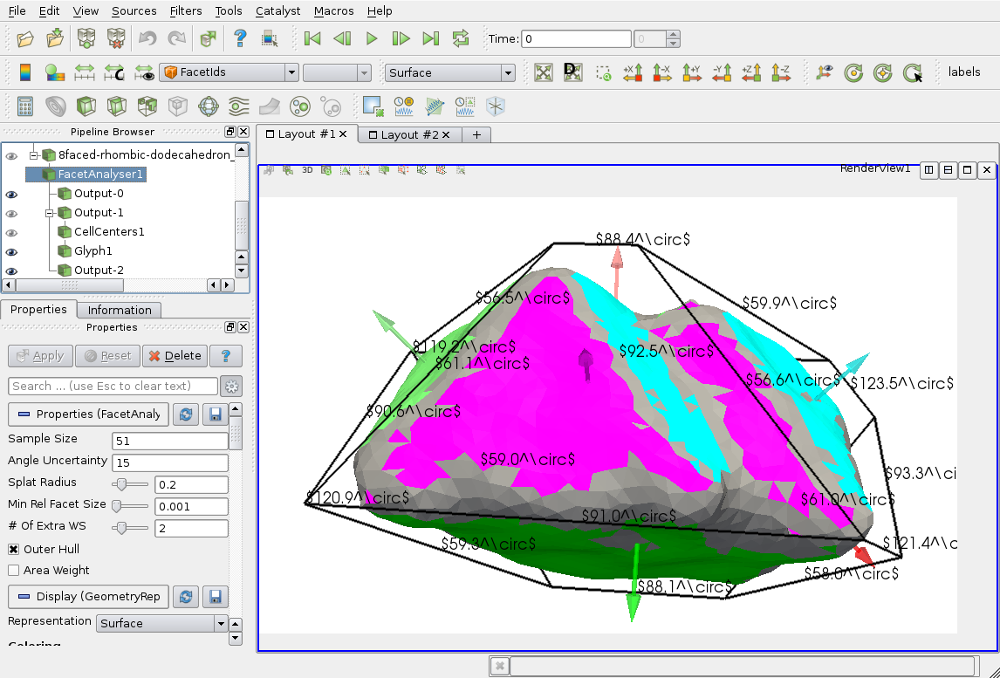

# FacetAnalyser
ParaView plugin for automated facet detection and measurement of interplanar angles of tomographic objects


See http://www.midasjournal.org/browse/publication/951 or http://hdl.handle.net/10380/3510 for more details.

An interactive 3D view of its demo-output can be seen
[here](http://romangrothausmann.github.io/FacetAnalyser/demos/WebGL/8faced-rhombic-dodecahedron_twinned_simp%2Bdef.html)
or
[here](http://romangrothausmann.github.io/FacetAnalyser/demos/X3D/8faced-rhombic-dodecahedron_twinned_simp%2Bdef.xhtml)
(needs WebGL).



## Installation


Configure ParaView with cmake as follows:

`BUILD_SHARED_LIBS  ON`  

Compile ParaView with make and optionally install it. The following ITK compilation does not need ParaView to be installed.

Configure ITK with cmake as follows, set /paraview-build-dir/ to the build directory used for building ParaView:

```
cmake \
-DVTK_DIR=/paraview-build-dir/VTK/ \
-DCMAKE_INSTALL_PREFIX=/ITK-install-dir_with-pvVTK/ \
-DModule_ITKVtkGlue=ON \
-DModule_ITKReview=ON \
-DBUILD_SHARED_LIBS=ON \
```

The two additionally enabled ITK modules are needed for the connection of VTK with ITK and for the watershed filters. It is essential, that VTK_DIR is set to the build directory containing VTK shipped with ParaView.

Then create a build dir and configure FacetAnalyser:

```
cmake \
-DITK_DIR=/ITK-install-dir_with-pvVTK/lib/cmake/ITK-*.*/ \
-DParaView_DIR=/paraview-build-dir/ \
-DBUILD_PLUGIN=ON \
-DBUILD_TESTING=ON \
-DBUILD_EXAMPLE=ON \
```


